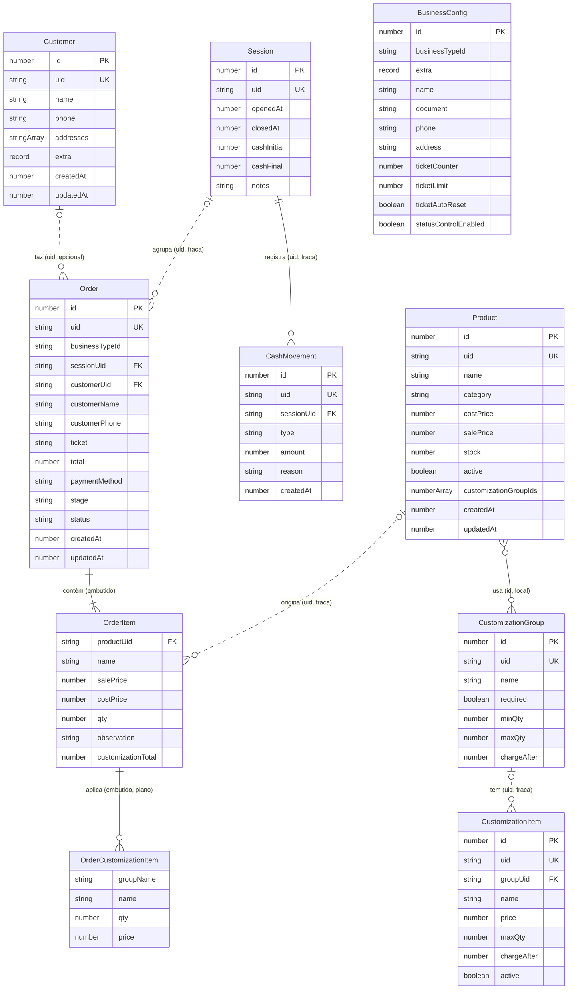

# Modelo de dados — Meu Bolso

Retrato do **modelo lógico** do Meu Bolso, **independente de infraestrutura**.
Descreve as entidades, seus campos e as relações entre elas — o contrato que
qualquer provider de persistência (Dexie hoje; API/Supabase/Postgres/Firebase no
futuro) precisa satisfazer, e a base do que a exportação de dados serializa.

Documentos relacionados:

- [`architecture.md`](./architecture.md) — as quatro camadas e o padrão
  Repository + Unit of Work.
- As entidades canônicas vivem em `src/domain/*/*.entity.ts`; este documento é o
  retrato consolidado delas.

> **Nota de evolução (futuro, fora de escopo hoje):** este documento é escrito à
> mão. A evolução planejada é promover o schema a **dado executável** em
> `domain/schema/` (agnóstico de infra) e **derivar** este diagrama a partir
> dele, eliminando divergência entre doc e código. Enquanto isso não existe,
> este `.md` é a fonte de referência visual.

## Convenções

- `id?: number` — chave primária autoincremento (`++id` no Dexie). É a
  identidade **local** de um aparelho; **não atravessa fronteira entre
  aparelhos**. Opcional no tipo porque só existe após a persistência.
- `uid: string` — identidade **estável e global** de uma entidade de negócio,
  gerada na criação (independente do autoincrement). É o que **viaja** na
  exportação/sync: o merge no master é um **upsert por `uid`**. Dois aparelhos
  nunca geram o mesmo `uid`, então não há colisão ao mesclar (ver Spec #4).
- **Referências entre entidades são por `uid`, fracas e anuláveis.** Um
  `productUid`/`customerUid`/`sessionUid` é uma _pista de origem_, não uma FK
  rígida: pode ser `null`/ausente, e a importação **nunca depende** de resolvê-la.
  Dentro de um mesmo aparelho o Dexie ainda usa `id` numérico para performance.
- Timestamps (`createdAt`, `updatedAt`, `openedAt`, ...) são **epoch em
  milissegundos** (`number`), não `Date`.
- Dinheiro é `number` em reais (ex.: `12.5` = R$ 12,50).
- Entidades **desnormalizam** (snapshot) os dados que precisam para se
  reconstruir sozinhas — ex.: `Order`/`OrderItem` copiam `name`/`salePrice` do
  produto no momento da venda e **não dependem** do produto existir no destino.

## Diagrama de entidades

## Entidades

> **Identidade e refs.** Toda entidade de negócio ganha `uid: string` (identidade
> estável que viaja no sync; ver Convenções). As referências entre entidades são
> por `uid`, **fracas e anuláveis** (`FK` no diagrama = ref fraca por uid, não
> constraint). `BusinessConfig` é a exceção: é singleton local, não é
> sincronizada, e por isso não tem `uid`. Campos marcados **(spec #1)** ou
> **(remodelagem)** ainda não existem no código — ver seção final.

### BusinessConfig `config` (singleton, `id = 1`)

Configuração única do estabelecimento. Sempre um registro (`CONFIG_ID = 1`).
Local ao aparelho — não sincroniza, não tem `uid`.

| Campo                  | Tipo                    | Notas                                             |
| ---------------------- | ----------------------- | ------------------------------------------------- |
| `id`                   | number PK               | fixo em 1                                         |
| `businessTypeId`       | string                  | **(spec #1)** tipo ativo; `''` se não escolhido   |
| `extra`                | `Record<string,string>` | **(spec #1)** valores de fields escopo `business` |
| `name`                 | string                  | nome do estabelecimento                           |
| `document`             | string                  | CNPJ/CPF                                          |
| `phone`                | string                  |                                                   |
| `address`              | string                  |                                                   |
| `ticketCounter`        | number                  | próximo número de comanda                         |
| `ticketLimit`          | number                  | teto do contador (default 9999)                   |
| `ticketAutoReset`      | boolean                 | reinicia o contador ao atingir o limite           |
| `statusControlEnabled` | boolean                 | liga o controle de `stage` (KDS)                  |

### Product `products`

| Campo                     | Tipo      | Notas                                  |
| ------------------------- | --------- | -------------------------------------- |
| `id`                      | number PK | local                                  |
| `uid`                     | string    | **(remodelagem)** identidade global    |
| `name`                    | string    | indexado                               |
| `category`                | string    | indexado                               |
| `costPrice`               | number    | custo                                  |
| `salePrice`               | number    | venda                                  |
| `stock`                   | number    |                                        |
| `active`                  | boolean   | indexado                               |
| `customizationGroupIds`   | number[]  | grupos aplicáveis (por `id` **local**) |
| `createdAt` / `updatedAt` | number    | epoch ms                               |

### CustomizationGroup `customizationGroups`

Grupo de adicionais (ex.: "Molhos"). `chargeAfter`: cobra a partir da N-ésima
unidade (as primeiras saem de graça).

| Campo         | Tipo      | Notas                                    |
| ------------- | --------- | ---------------------------------------- |
| `id`          | number PK | local                                    |
| `uid`         | string    | **(remodelagem)** identidade global      |
| `name`        | string    | indexado                                 |
| `required`    | boolean   | obriga escolha                           |
| `minQty`      | number    | mínimo exigido                           |
| `maxQty`      | number    | máximo permitido                         |
| `chargeAfter` | number    | nº de unidades gratuitas antes de cobrar |

### CustomizationItem `customizationItems`

Item de um grupo (ex.: "Maionese").

| Campo         | Tipo      | Notas                                                |
| ------------- | --------- | ---------------------------------------------------- |
| `id`          | number PK | local                                                |
| `uid`         | string    | **(remodelagem)** identidade global                  |
| `groupUid`    | string    | **(remodelagem)** ref fraca → CustomizationGroup.uid |
| `name`        | string    |                                                      |
| `price`       | number    |                                                      |
| `maxQty`      | number    | máximo deste item                                    |
| `chargeAfter` | number    | gratuitas antes de cobrar                            |
| `active`      | boolean   | indexado                                             |

### Customer `customers`

Sem unicidade rígida de `phone`: no escoteiro o identificador pode não ser
telefone. A identificação/deduplicação é responsabilidade do **use case** por
tipo de negócio (ver Spec #2 — mesclar clientes), não do storage.

| Campo                     | Tipo                    | Notas                                             |
| ------------------------- | ----------------------- | ------------------------------------------------- |
| `id`                      | number PK               | local                                             |
| `uid`                     | string                  | **(remodelagem)** identidade global               |
| `name`                    | string                  | indexado                                          |
| `phone`                   | string                  | **(remodelagem)** opcional, **sem UK**            |
| `extra`                   | `Record<string,string>` | **(spec #1)** valores de fields escopo `customer` |
| `addresses`               | string[]                | endereços salvos                                  |
| `createdAt` / `updatedAt` | number                  | epoch ms                                          |

### Session `sessions`

Sessão de caixa (um "dia" de operação). `cashFinal`/`closedAt` nulos enquanto
aberta. O `uid` é o que a `Order` referencia — na importação, o master casa a
sessão por `uid`; se não existir, **cria uma nova** (cada aparelho é um operador).

| Campo         | Tipo           | Notas                               |
| ------------- | -------------- | ----------------------------------- |
| `id`          | number PK      | local                               |
| `uid`         | string         | **(remodelagem)** identidade global |
| `openedAt`    | number         | indexado                            |
| `closedAt`    | number \| null | null = sessão aberta; indexado      |
| `cashInitial` | number         | troco inicial (contado ao abrir)    |
| `cashFinal`   | number \| null | contagem no fechamento              |
| `notes`       | string         |                                     |

### CashMovement `cashMovements`

Sangria (retirada) ou suprimento (entrada) de caixa dentro de uma sessão.

| Campo        | Tipo      | Notas                                     |
| ------------ | --------- | ----------------------------------------- |
| `id`         | number PK | local                                     |
| `uid`        | string    | **(remodelagem)** identidade global       |
| `sessionUid` | string    | **(remodelagem)** ref fraca → Session.uid |
| `type`       | string    | `'sangria'` \| `'suprimento'`; indexado   |
| `amount`     | number    |                                           |
| `reason`     | string    |                                           |
| `createdAt`  | number    | epoch ms                                  |

### Order `orders`

A comanda/pedido. **Autossuficiente:** reconstrói-se sozinha a partir dos dados
embutidos (snapshots), sem depender de Product/Customer/Session existirem no
destino. Referências são por `uid`, fracas e anuláveis. Não se vincula a
`BusinessConfig` — guarda apenas `businessTypeId` para saber o modo de origem.

| Campo                     | Tipo           | Notas                                                             |
| ------------------------- | -------------- | ----------------------------------------------------------------- |
| `id`                      | number PK      | local                                                             |
| `uid`                     | string         | **(remodelagem)** identidade global                               |
| `businessTypeId`          | string         | **(remodelagem)** modo de origem (`scout`, `quick_sale`, ...)     |
| `sessionUid`              | string         | **(remodelagem)** ref fraca → Session.uid                         |
| `customerUid`             | string \| —    | **(remodelagem)** ref fraca → Customer.uid (opcional)             |
| `customerName`            | string         | snapshot                                                          |
| `customerPhone`           | string         | snapshot                                                          |
| `ticket`                  | string         | número da comanda                                                 |
| `total`                   | number         |                                                                   |
| `paymentMethod`           | string \| null | indexado; null enquanto não pago                                  |
| `stage`                   | OrderStage     | `aceito` \| `em_preparo` \| `a_caminho` \| `finalizado`; indexado |
| `status`                  | OrderStatus    | `open` \| `paid` \| `pending` \| `cancelled`                      |
| `items`                   | OrderItem[]    | embutido (ver abaixo)                                             |
| `createdAt` / `updatedAt` | number         | epoch ms; `createdAt` indexado                                    |

### OrderItem (embutido em `Order.items`)

Linha da comanda, **totalmente snapshot** — não depende do produto existir.
`productUid` é só uma pista de origem (anulável).

| Campo                | Tipo                          | Notas                                             |
| -------------------- | ----------------------------- | ------------------------------------------------- |
| `productUid`         | string \| —                   | **(remodelagem)** ref fraca → Product.uid (pista) |
| `name`               | string                        | snapshot                                          |
| `salePrice`          | number                        | snapshot                                          |
| `costPrice`          | number                        | snapshot                                          |
| `qty`                | number                        |                                                   |
| `observation`        | string \| —                   | opcional                                          |
| `customizations`     | OrderCustomizationItem[] \| — | **(remodelagem)** lista **plana** de adicionais   |
| `customizationTotal` | number \| —                   | acréscimo dos adicionais                          |

### OrderCustomizationItem (embutido em `OrderItem.customizations`)

Achatado: o nome do grupo vira coluna do próprio item (não há mais nível
`OrderCustomization` intermediário). Tudo snapshot.

| Campo       | Tipo   | Notas                               |
| ----------- | ------ | ----------------------------------- |
| `groupName` | string | **(remodelagem)** snapshot do grupo |
| `name`      | string | snapshot do item                    |
| `qty`       | number |                                     |
| `price`     | number | snapshot                            |

## Índices (visão de infra — Dexie hoje)

Só para referência; **não** faz parte do modelo lógico. Fonte:
`src/infrastructure/dexie/dexie-database.ts` (schema `pdv_v2`, version atual 4).
A remodelagem adiciona `uid` como índice único (`&uid`) nas stores
sincronizáveis e troca refs numéricas por refs de `uid`.

| Store                 | Índices (atuais)                                           |
| --------------------- | ---------------------------------------------------------- |
| `products`            | `++id, name, category, active`                             |
| `orders`              | `++id, sessionId, status, paymentMethod, createdAt, stage` |
| `sessions`            | `++id, openedAt, closedAt`                                 |
| `cashMovements`       | `++id, sessionId, type`                                    |
| `config`              | `++id`                                                     |
| `customizationGroups` | `++id, name`                                               |
| `customizationItems`  | `++id, groupId, active`                                    |
| `customers`           | `++id, &phone, name`                                       |

## Mudanças planejadas

Duas frentes, ambas **aditivas/não-destrutivas** numa nova `version(5)` do Dexie
com `.upgrade()` preenchendo defaults e gerando `uid` para registros existentes.

### Spec #1 — tipo de negócio

| Entidade         | Campo novo       | Tipo                    | Default na migração  |
| ---------------- | ---------------- | ----------------------- | -------------------- |
| `BusinessConfig` | `businessTypeId` | string                  | `''` (não escolhido) |
| `BusinessConfig` | `extra`          | `Record<string,string>` | `{}`                 |
| `Customer`       | `extra`          | `Record<string,string>` | `{}`                 |

Ver [`.superpowers/specs/2026-07-07-business-type-design.md`](../.superpowers/specs/2026-07-07-business-type-design.md).
Trocar de tipo nunca remove dados de `extra`.

### Remodelagem para sync resiliente (habilita specs #2 e #4)

- **`uid: string`** em toda entidade de negócio (Product, CustomizationGroup,
  CustomizationItem, Customer, Session, CashMovement, Order). Gerado no
  `.upgrade()` para registros existentes.
- **Refs por `uid`, fracas e anuláveis** substituem FKs numéricas que atravessam
  fronteira: `Order.sessionUid`/`customerUid`, `OrderItem.productUid`,
  `CashMovement.sessionUid`, `CustomizationItem.groupUid`.
- **`Order` autossuficiente:** `businessTypeId` embutido; snapshots completos;
  sem vínculo com `BusinessConfig`.
- **Customizações achatadas:** remove `OrderCustomization`; `OrderItem.customizations`
  é lista plana de `OrderCustomizationItem` com `groupName` embutido.
- **`Customer.phone`** opcional, sem unicidade de storage.

> **Nota:** o `id` numérico local **permanece** como PK do Dexie (performance
> intra-aparelho). O que muda é que **nada que atravessa aparelhos** referencia
> `id` — só `uid`. Merge no master = upsert por `uid` (specs #2 e #4).
